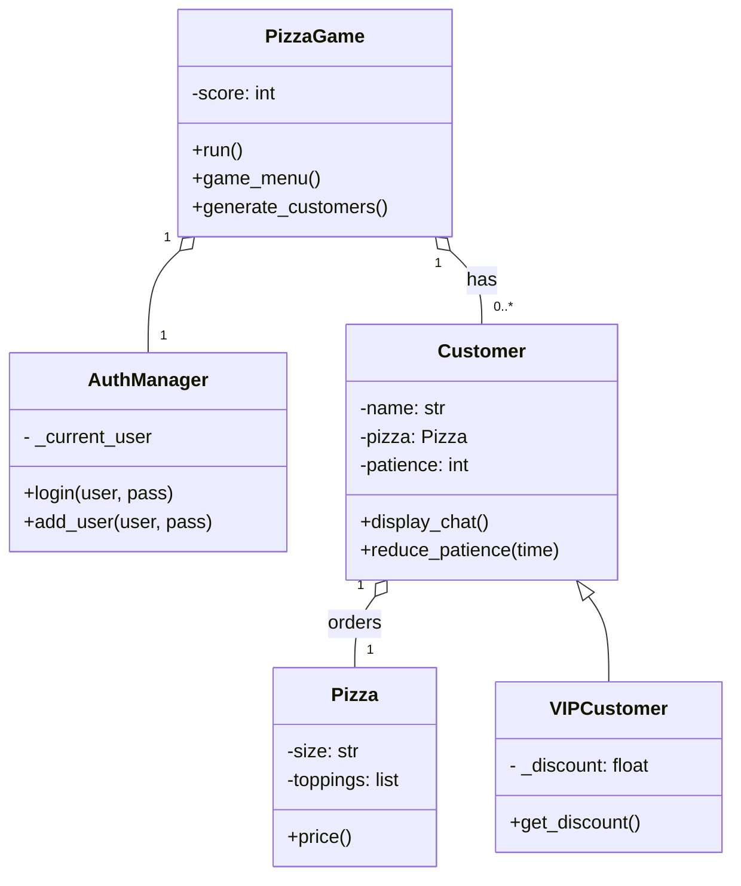

[EN](../README.md) | [ID](READMEid.md) | 中文
# 🍕 Python 披萨店模拟器


欢迎来到 Python 披萨店模拟器！这是一款动态的、基于文本的游戏，您将在其中扮演一家繁忙而古怪的餐厅里的披萨厨师。您的目标是接收来自各种有趣顾客的订单，正确制作他们的披萨，并在他们失去耐心之前为他们服务！

该项目完全由 Python 构建，在一个有趣的互动式命令行环境中展示了面向对象编程、多线程和用户认证等关键编程概念。

## 🕹️ 游戏玩法演示

整个游戏在您的终端中运行。以下是您将看到的内容快速预览：

**一位顾客带着独特的订单和提示到来：**
```
──────────────────────────────────────
🍕 CUSTOMER ORDER
──────────────────────────────────────
👤 Nama      : Nenek Superhero [VIP]
⏳ Kesabaran : 35 detik (Prioritas)
📦 Pesanan   : Pizza Medium
   - Exploding Peppers
   - Tomato Sauce
💡 Hint      :
   • BOOM! Careful, it bites!
   • Red like a superhero cape!
💰 Harga     : Rp 97,000
   Diskon 25.1% → Rp 72,629
──────────────────────────────────────
```

**然后，您从列表中选择正确的配料以完成订单：**
```
[ TOPPING LIST ]
========================================
1. Cheese          | 6. Exploding Peppers
2. Pepperoni       | 7. Unicorn Glitter
3. Mushroom        | 8. Zombie Fingers
4. Olives          | 9. Invisible Onions
5. Tomato Sauce    | 10. Magic Dust
========================================

> Pilih 2 topping: 6 5

✔ Pesanan untuk Nenek Superhero selesai!
```

## ✨ 核心功能

-   **面向对象设计**：游戏采用清晰、可重用的类（如 `Pizza`、`Customer` 和 `VIPCustomer`）构建，展示了坚实的 OOP structure。
-   **多线程**：一个独立的线程在您游戏时于后台生成新顾客，使游戏充满动态和不可预测性。
-   **实时挑战**：顾客有一个“耐心”计时器，它会根据您制作订单所需的时间而减少。快速为他们服务，否则他们会离开！
-   **VIP 顾客**：遇到特殊的 VIP 顾客，他们有更高的优先级但提供折扣价。此功能展示了**继承**的使用。
-   **用户认证**：一个简单的登录和注册系统，确保玩家的得分与特定用户绑定。
-   **计分系统**：为每个正确完成的订单赚取积分，并跟踪您的表现。
-   **交互式菜单**：游戏通过一系列直观的命令行菜单进行导航。

## 🛠️ 技术概念展示

-   **面向对象编程 (OOP)**：广泛使用类和对象来建模游戏组件。
-   **继承 (Inheritance)**：`VIPCustomer` 类继承并扩展了 `Customer` 类。
-   **封装 (Encapsulation)**：`AuthManager` 和 `VIPCustomer` 类使用私有属性来保护其内部状态。
-   **多线程 (Multithreading)**：使用 `threading` 模块使顾客生成过程与主游戏循环并行运行。
-   **数据结构 (Data Structures)**：使用列表和字典来管理顾客、配料、价格和用户数据。

## 🏛️ 架构与类图

该游戏的架构以 `PizzaGame` 类为中心，该类管理主循环和游戏状态。它利用 `AuthManager` 进行用户会话，并动态生成 `Customer` 对象，这些对象也可以是专门的 `VIPCustomer` 对象。



## 🚀 如何游戏

1.  **运行脚本**：从您的终端启动游戏。
2.  **登录/注册**：创建一个新用户或使用现有用户登录。
3.  **开始游戏**：从主大厅选择“开始游戏”。
4.  **等待顾客**：新顾客将每20秒自动到达。
5.  **服务顾客**：从游戏菜单中，按编号选择一位顾客以查看其订单。
6.  **阅读提示**：利用顾客的独特提示来弄清楚他们想要哪些配料。
7.  **制作披萨**：输入与正确配料相对应的数字以完成订单。
8.  **赚取积分**：正确的订单会为您赢得积分。快速而准确地获得最高分！

## ⚙️ 开始使用

运行此游戏不需要特殊库，只需要标准的 Python 安装。

### 先决条件
- Python 3.x

### 运行游戏
1.  将代码另存为 Python 文件（例如，`PizzaTrinity.py`）。
2.  打开一个终端或命令提示符。
3.  导航到您保存文件的目录。
4.  运行以下命令：
    ```sh
    python PizzaTrinity.py
    ```
5.  按照屏幕上的说明进行游戏！

## 👥 作者与贡献者

<table border="0" cellspacing="10" cellpadding="5">
  <tr>
    <td align="center" style="border: 1px solid #555; padding: 10px;">
      <a href="https://github.com/Serthons">
        
      </a>
      <br/>
      <a href="https://github.com/Serthons">Serthons</a>
    </td>
    <td align="center" style="border: 1px solid #555; padding: 10px;">
      <a href="https://github.com/Jensenix">
        
      </a>
      <br/>
      <a href="https://github.com/Jensenix">Jensenix</a>
    </td>
    <td align="center" style="border: 1px solid #555; padding: 10px;">
      <a href="https://github.com/vincentlawi">
        
      </a>
      <br/>
      <a href="https://github.com/vincentlawi">vincentlawi</a>
    </td>
  </tr>
</table>